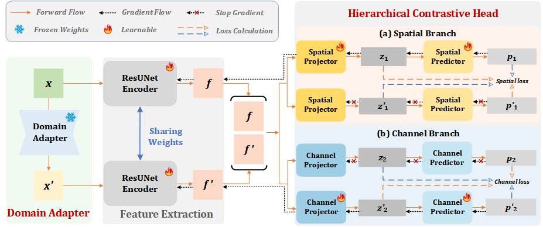

# SSLChange
Pytorch codes for SSLChange Framework

This is an overview of our proposed SSLChange framework for Remote Sensing Change Decetion tasks.  

Thanks for your attention on our work. The codes will be published after our paper is accepted. 

